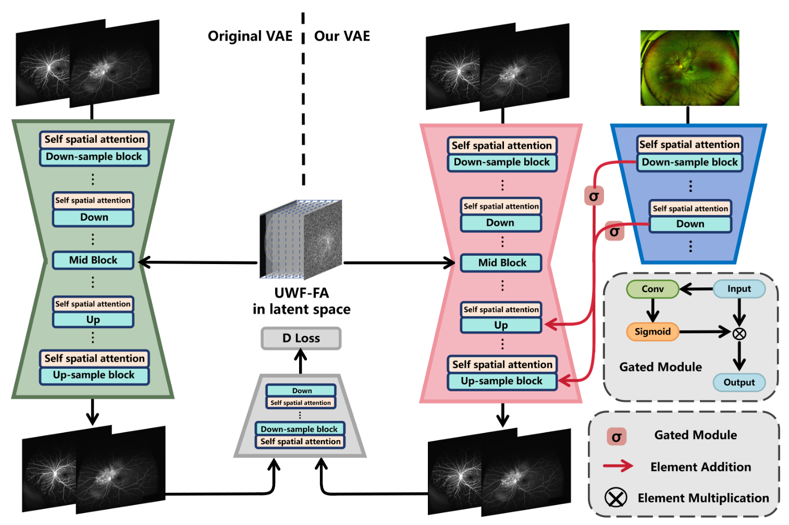
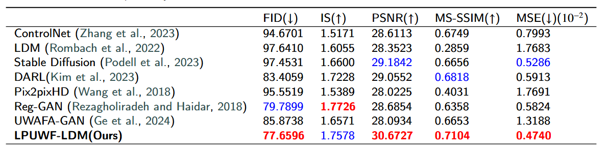

# **LPUWF-LDM**

Overall structure of the LPUWF-LDM:


Gated Convolutional Encoder:


Comparison of generating late-phase UWF-FA between different generation networks:


Comparison of generative metrics for various generation networks.:


## Pre-requisties
This code is the pytorch implementation of LPUWF-LDM
- Linux
- numpy==1.26.3
- torch==2.0.0+cu118
- tqdm==4.66.2
- accelerate==0.27.2
- monai==1.3.0
- PyYAML==6.0.1
- natsort==8.4.0
- monai-generative==0.2.3
- lpips==0.1.4
- tensorboard==2.15.1

## How to train
### Example Data
We take 4 pairs images in training set and 3 pairs in validation set to be an example. They are already lied in the directory "./data". For a pair, x.bmp means UWF-SLO, x.1.bmp and x.2.bmp means early-phase late-phase UWF-FA, respectively. 
### First stage: Conditional VAE (C-VAE)
The position of config for training vae is in the directory: "config/vae/config_monaivae_zheer.py"
```
from dataclasses import dataclass


@dataclass
class Config():
    train_bc = 1
    eval_bc = 2
    num_epochs = 2000
    data_path = ['data/train']
    eval_path = 'data/test'
    single_channel = True
    mode = 'double'
    val_length = 2000

    # train process configuration
    val_inter = 80
    save_inter = 100
    sample_size = (512, 512)

    # model parameters
    in_channels = 1
    out_channels = 1
    up_and_down = (128, 256, 512)
    num_res_layers = 2
    vae_path = '' # set it if you want to continue training
    dis_path = '' # Example: weights/exp_X_XX/gen_save/vae.pth

    autoencoder_warm_up_n_epochs = 100
    # accelerate config
    split_batches = False
    mixed_precision = 'fp16'
    log_with = 'tensorboard'
    project_dir = 'weights/exp_test'
    gradient_accumulation_steps = 1
```
vae_path and dis_path is for the continue training. project_dir to save current results. To train the c-vae, run the command: 
```
python my_vqvae/train_cvae.py
```

### Second stage: Early-phase UWF-FA Diffusion
The position of config for training vae is in the directory: "config/diffusion/config_zheer_controlnet.py"
```
from dataclasses import dataclass


@dataclass
class Config():
    train_bc = 1
    eval_bc = 2
    num_epochs = 1000
    data_path = ['data/train']
    eval_path = 'data/test'
    single_channel = False
    mode = 'double'
    val_length = 2000

    # train process configuration
    val_inter = 100
    save_inter = 100
    sample_size = 512

    # aekl parameters
    in_channels = 1
    out_channels = 1
    up_and_down = (128, 256, 512)
    num_res_layers = 2
    scaling_factor = 0.18215
    vae_resume_path = '' # Example: weights/exp_X_XX/gen_save/vae.pth


    # stable_model parameters
    sd_num_channels = (128, 256, 512, 1024)
    attention_levels = (False, False, True, True)
    sd_resume_path = '' # Example: weights/exp_X_XX/model_save/model.pth
    controlnet_path = '' # Example: weights/exp_X_XX/model_save/controlnet.pth
    
    # controlnet_model parameters
    conditioning_embedding_num_channels = (32, 96, 256)
    diff_loss_coefficient = 0.25
    offset_noise = True
    
    # accelerate config
    split_batches = False
    mixed_precision = 'fp16'
    log_with = 'tensorboard'
    project_dir = 'weights/exp_X_XX'
```
In this stage, remember to set the vae_resume_path that is previously train. project_dir to save the results in this stage. To train, run the command: 
```
python diffusion/LPUWF_LDM.py
```

### Third stage: Late-phase UWF-FA Diffusion
To train in this stage, set the parameter sd_resume_path and controlnet_path according to the previous training directory. Run the command: 
```
python diffusion/LPUWF_LDM_late.py
```
